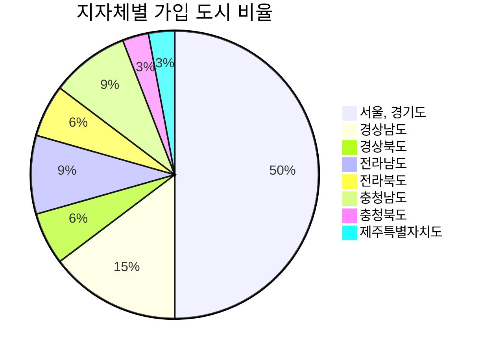

# Curated list of Age Friendly City
본 프로젝트는 고령친화 도시 설계를 위한 참고자료에 대한 유용한 리스트를 구축하고자 합니다. 고령친화 도시 설계와 관련된 데이터저장소, 데이터셋, 논문, 정책자료, 뉴스 등 다양한 유형의 국내외 유용한 자료를 한 곳에 모으고자 합니다. 큐레이트된 리스트(Curated list)는 고령친화 도시 설계를 위한 목적에 누구나 자유롭게 활용될 수 있습니다. 

## 수집현황
* 고령친화 도시란?
  * 노인을 중심으로 한 사회복지와 노인의 편의를 위한 도시정책이 융합된 지역사회
  * 기존의 도시환경을 고령 친화적환경으로 개선하는 것    
   
* 고령친화 도시의 건설 이유
  * 노인 인구의 지속적인 증가와 이로 인한 노인들의 욕구 증대를 지역 사회적 측면에서의 적극적으로 대응하기 위함
  * 사회적 약자로 분류된 노인을 위해 사회복지서비스 및 생활환경 조성을 하는 것을 주목적으로 하는 측면에서 정의계획의 범주에 포함
  * 은퇴 후에 새로운 일자리를 찾을 수 있는 정보의 접근성문제, 세대 간에 공유할수 있는 프로그램 개발 등, 고령친화와 관련된 사회적 분위기와 정책적 기반이 지속적으로 유지될수 있게 하기 위함

[한국형 고령친화도시 점검척도 개발연구](https://www.dbpia.co.kr/pdf/pdfView.do?nodeId=NODE02245398&mark=0&useDate=&ipRange=N&accessgl=Y&language=ko_KR&hasTopBanner=true)

* 고령친화도시 조성의 필요성
  * 급속한 고령화에 따른 환경 및 삶의 급격함 변화를 지금의 도시기반 시설이 따라가지 못하며 
    특히 사회적 약자인 노인들에게 있어 더욱 불편하기에 누구든지 지금의 삶에 불편없이 살아 갈 수 있도록 
    적극적인 지원 및 서비스가 필요하다.

[고령친화도시의 개념과 조성의 필요성](http://afc.bswdi.re.kr/Main.do)

### 고령친화적인 지역 사회 개발을 위한 주요 전략
* 시민의 요구와 선호 변화에 적절한 주거와 교통옵션 제공
  - 토지이용과 지역개발 과정 통합, 대안적 주거유형 및 서비스 개발, 대중교통 개선 등
  
* 건강한 라이프 스타일 유지
  - 예방서비스에 대한 접근성 개선, 신체적 활동 기회 제공, 건강교육 등
  
* 서비스와 정보의 접근성을 확대
  - 예방적인 정보 제공과 교육
  - 병원과 재활기관을 포함한 서비스 간의 연계 확대
 
[참고자료](https://www.si.re.kr/si_download/42542/7066)

### 해외 고령친화도시의 성공사례
[참고자료](https://extranet.who.int/agefriendlyworld/resources/age-friendly-case-studies/): 고령친화도시 및 커뮤니티 개발: 전 세계 사례 연구

### 국내 고령친화도시의 과거실패사례
우리나라는 2007년 고령친화 모델 지역으로 4개의 지역이 선정되었지만 실질적인 변화를 가져오지 못했다. 우리는 이런 실패이유를 통해 더 개선된 고령친화도시를 설계할수있다.
* 첫번째 이유 : 목적이 지역 활성화에 초점을 두고있었다.
* 두번쨰 이유 : 적절한 예상지원이 따르지않아 실제적인 추진도 미흡하였다.
* 세번째 이유 : 지역개발의 목표 선정, 실행과정,평가 등에 대한 가이드라인이나 지침도 없고 의료,
                복지,고용, 교통 등 기본영역에 대한 논의도 기초적인 수준에 머무르고 있었다

따라서 국제보건기구(WHO)의 고령친화도시 모델과 빌리지 모델등에 대한 검토를 통해 이들이 시사하는 바를 살펴볼 필요가 있다.

[참고 자료](https://www.dbpia.co.kr/Journal/articleDetail?nodeId=NODE02007530)

### [고령친화도시 국제네트워크(Global Network of Age-Friendly Cities & Communities, GNAFCC)](https://github.com/pwjdgus/Age_Friendly_City/blob/main/%EA%B3%A0%EB%A0%B9%EC%B9%9C%ED%99%94%EB%8F%84%EC%8B%9C%EA%B5%AD%EC%A0%9C%EB%84%A4%ED%8A%B8%EC%9B%8C%ED%81%AC.md)

* **고령친화도시 국제네트워크(Global Network of Age-Friendly Cities & Communities, GNAFCC)**  전 세계적인 고령화와 도시화 추세에 더욱 효과적으로 대응해나가기 위해 세계보건기구(WHO)에 의해 2007년부터 추진되어온 프로젝트로서, 2022년 현재 47개국 1333개 도시가 회원으로 가입되어 있다.  
 GNAFCC의 회원이 된다는 것은 인증과 다른 개념으로 해당 도시가 당면한 고령화와 관련된 문제의 대응 방안을 마련하고 해결 노력을 지속해서 기울이고 있다는 점을 인정받는 것이다. 더 나아가서는 다른 도시들의우수한 사례와 경험을 공유하는 등 국제적정보 교류의 장에 참여할 수 있는 기회를 부여받는다

* **고령친화도시 가이드**  GNAFCC는 기본적으로 활기찬 노년(Active aging)과 정든 곳에서 나이 들어감(Aging in place) 등을 주요한 가치로 삼고있는 만큼, 도시 내 노인의 삶의 질 향상을 주요 목적으로 제시하고 있으며, 궁극적으로는 노인을 비롯한 전 세대의 모든 시민이 다 함께 살기 좋은 도시환경 조성을 지향하고 있다.  
  이를 위하여 도시환경을 전반적으로 바라보는 거시적인 안목의 형성과 노인당사자의 의견 수렴을 중요시하고 있다. 이러한 기본 방향에 따라 WHO는 2006년부터 2007년까지 전 세계 33개국 노인과
노인 부양자, 서비스 제공자 약 2,000명을 대상으로 초점집단인터뷰(FGI)를 진행하고 그 결과에 기초하여 고령친화도시 가이드(WHO, 2007)를 마련했다.  

* **지자체별 고령친화도시 국제네트워크 가입 도시 현황**

| 지방자치단체 | 고령친화도시 국제네트워크 가입 도시 현황 |
|---|:---:|
| `강원도` | |
| `서울,경기도  ` | 마포구 , 동구(인천) , 영등포구 , 미추홀구(인천) , 금천구 , 의왕시 , 용산구 , 성남시 , 종로구, 성동구 , 서초구 , 수원 , 노원구 , 도봉구 , 양천구 , 부천시 , 강북구 |
| `경상남도` | 고성군 , 통영시 , 창원시 , 남해군 , 부산시|
| `경상북도` | 울산 , 칠곡군|
| `전라남도` | 화순군 , 광주 , 나주시|
| `전라북도` | 완주군 , 정읍시 |
| `충청남도` | 부여군 , 공주시 , 논산|
| `충청북도` | 세종시(세종특별자치시) |
| `제주특별자치도` | 제주시 |

### 지방자치단체별 고령친화도시 정책 및 현황

[지방자치단체별 고령친화도시 정책 및 현황](https://github.com/pwjdgus/Age_Friendly_City/blob/nsbranch2/%EC%A7%80%EB%B0%A9%EC%9E%90%EC%B9%98%EB%8B%A8%EC%B2%B4%EB%B3%84%20%EA%B3%A0%EB%A0%B9%EC%B9%9C%ED%99%94%EB%8F%84%EC%8B%9C%20%EC%A0%95%EC%B1%85%20%EB%B0%8F%20%ED%98%84%ED%99%A9.md)

