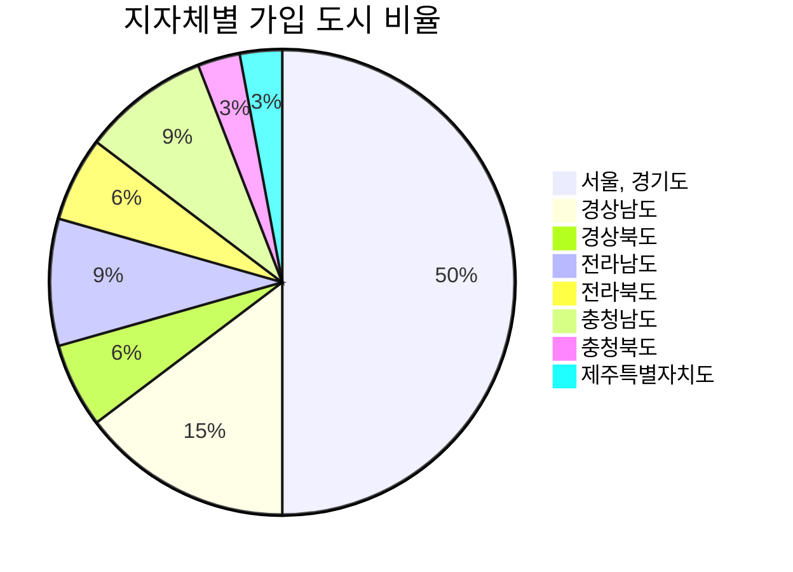

### 고령친화도시 국제네트워크

* **고령친화도시 국제네트워크(Global Network of Age-Friendly Cities & Communities, GNAFCC)**  전 세계적인 고령화와 도시화 추세에 더욱 효과적으로 대응해나가기 위해 세계보건기구(WHO)에 의해 2007년부터 추진되어온 프로젝트로서, 2022년 현재 47개국 1333개 도시가 회원으로 가입되어 있다.  
 GNAFCC의 회원이 된다는 것은 인증과 다른 개념으로 해당 도시가 당면한 고령화와 관련된 문제의 대응 방안을 마련하고 해결 노력을 지속해서 기울이고 있다는 점을 인정받는 것이다. 더 나아가서는 다른 도시들의우수한 사례와 경험을 공유하는 등 국제적정보 교류의 장에 참여할 수 있는 기회를 부여받는다

* **고령친화도시 가이드**  GNAFCC는 기본적으로 활기찬 노년(Active aging)과 정든 곳에서 나이 들어감(Aging in place) 등을 주요한 가치로 삼고있는 만큼, 도시 내 노인의 삶의 질 향상을 주요 목적으로 제시하고 있으며, 궁극적으로는 노인을 비롯한 전 세대의 모든 시민이 다 함께 살기 좋은 도시환경 조성을 지향하고 있다.  
  이를 위하여 도시환경을 전반적으로 바라보는 거시적인 안목의 형성과 노인당사자의 의견 수렴을 중요시하고 있다. 이러한 기본 방향에 따라 WHO는 2006년부터 2007년까지 전 세계 33개국 노인과
노인 부양자, 서비스 제공자 약 2,000명을 대상으로 초점집단인터뷰(FGI)를 진행하고 그 결과에 기초하여 고령친화도시 가이드(WHO, 2007)를 마련했다.  

* **WHO 고령친화도시 8대 영역 가이드라인** 
  | 8대 영역 | 주요 내용 |
  |:---:|:---:|
  | `외부환경과 시설(Outdoor spaces and buildings)` | 야외 환경과 공공건물 등을 포괄하며, 도시 기반시설의 안전성, 편리성, 접근성 향상으로 삶의 질 제고 |
  | `교통수단편의성(Transportation)` | 이용이 쉽고 저렴한 대중교통 편의 환경 구축을 통해 고령자의 사회 참여 및 의료서비스 접근성 제고 | 
  | `주거환경안정성(Housing)` | 령친화적 주거시설의 구조, 디자인, 위치, 비용 및 공공서비스 설계를 통해 편안하고 안전한 삶 구현 |
  | `여가 및 사회활동(Social participation)` | 고령자의 가족․ 사회․문화․ 종교․ 여가활동을 위한 접근성, 행정·정보지원체계 구축을 통해 사회적 소속감 증대 |
  | `사회참여와 및 일자리(Civic participation and employment)` | 고령자의 욕구에 따른 인적자원 개발, 자원봉사 및 취업기회의 제공·확대를 통한 시민 참여활동 독려 및 지역사회 공헌 구현 |
  | `사회적 존중 및 통합(Respect and social inclusion)` | 고령자 공공이미지 향상을 위해 초중등 교육내용 반영 및 대중언론 매체 활용, 지역사회 내 고령자 욕구에 따른 역할 강화 등을 통해 세대간 통합 제고 |
  | `의사소통 및 정보(Communication and information)` | 고령자의 특성을 반영한 다양한 정보제공체계 구축 및 접근성 강화를 통해 사회적 활동 및 인간관계 활성화 |
  | `건강 및 지역사회 돌봄(Community support and health services)` | 고령자를 위한 지역사회서비스 및 의료서비스의 충분성, 적절성, 접근성, 질적 강화를 통해 고령자의 건강 및 자립 증대|

[고령친화도시 국제네트워크](https://extranet.who.int/agefriendlyworld/), [세종시청 홈페이지](https://www.sejong.go.kr/citizen/sub05_0402.do;jsessionid=wDwIoFnTe2MfMCl1PxvJtlR7VXI8XfhwNdDVU2B68fOqf7Rq4UO43CtUPMx0YXMH.Portal_WAS2_servlet_engine5)

* 지방자치단체별 고령친화도시 정책 및 현황
 
| 지방자치단체 | 정책 및 현황 |
|---|:---:|
| `강원도` | [노인들이 행복한 강원도형 고령친화도시 만든다](http://www.kwnews.co.kr/nview.asp?s=501&aid=216031700101) |
| `서울,경기도` | [금천구, 세계보건기구(WHO)가 인증한 ‘고령친화도시’](http://www.viva100.com/main/view.php?key=20211025010006029) [의왕시, WHO 고령친화도시 인증](http://www.enewstoday.co.kr/news/articleView.html?idxno=1507071) |
| `경상남도` | [동아대-부산 서구청, 고령친화도시 조성 위한 업무협약 체결](http://www.busan.com/view/busan/view.php?code=2022040114332108171) [통영시 대한노인회 노인복지대상 ‘대상’ 수상](http://www.gndomin.com/news/articleView.html?idxno=307846) [통영시, '어르신센터' 업무협약식 개최](http://www.sisa-news.com/news/article.html?no=191056) |
| `경상북도` | [김희수 경북도의원, 경상북도 고령친화도시 조성 지원 조례(안) 발의](http://www.dkilbo.com/news/articleView.html?idxno=174343) |
| `전라남도` | [광주시, 노후 걱정 없는 100세 도시 만든다](https://www.breaknews.com/875403) [나주시, 고령친화도시 그림공모전 수상작 발표](http://daily.hankooki.com/news/articleView.html?idxno=693871) |
| `전라북도` | [완주군, WHO 고령친화도시 인증 선포](http://www.kukinews.com/newsView/kuk202203240148) |
| `충청남도` | [충남 부여군 ‘WHO 고령친화도시’ 인증 획득](http://daily.hankooki.com/news/articleView.html?idxno=802305) [공주시, WHO고령친화도시 인증](http://www.newsfreezone.co.kr/news/articleView.html?idxno=331637) |
| `충청북도` | [음성군, 고령친화도시 조성 추진한다.](http://www.dynews.co.kr/news/articleView.html?idxno=643333) [충북서 노인 가장 많은 괴산군, 고령친화도시 추진](https://www.khan.co.kr/local/Chungbuk/article/202201091254001) |
| `제주특별자치도` | [제주도, WHO 고령친화도시 국제네트워크 가입](http://www.jejusori.net/news/articleView.html?idxno=193662) [제주도, 5년간 WHO 고령친화도시 제2기 실행계획 45개 사업 추진](http://www.headlinejeju.co.kr/news/articleView.html?idxno=436711) |
