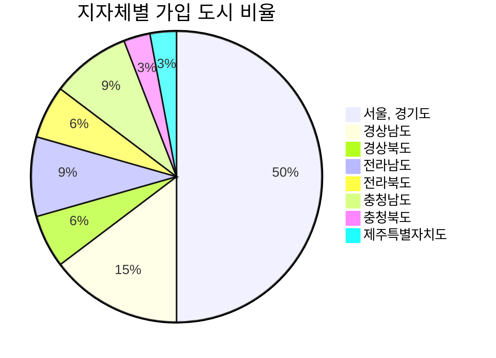

### 지방자치단체별 고령친화도시 정책 및 현황

| 지방자치단체 | 정책 및 현황 |
|---|:---:|
| `강원도` | [노인들이 행복한 강원도형 고령친화도시 만든다](http://www.kwnews.co.kr/nview.asp?s=501&aid=216031700101) |
| `서울,경기도` | [금천구, 세계보건기구(WHO)가 인증한 ‘고령친화도시’](http://www.viva100.com/main/view.php?key=20211025010006029) [의왕시, WHO 고령친화도시 인증](http://www.enewstoday.co.kr/news/articleView.html?idxno=1507071) |
| `경상남도` | [동아대-부산 서구청, 고령친화도시 조성 위한 업무협약 체결](http://www.busan.com/view/busan/view.php?code=2022040114332108171) [통영시 대한노인회 노인복지대상 ‘대상’ 수상](http://www.gndomin.com/news/articleView.html?idxno=307846) [통영시, '어르신센터' 업무협약식 개최](http://www.sisa-news.com/news/article.html?no=191056) |
| `경상북도` | [김희수 경북도의원, 경상북도 고령친화도시 조성 지원 조례(안) 발의](http://www.dkilbo.com/news/articleView.html?idxno=174343) |
| `전라남도` | [광주시, 노후 걱정 없는 100세 도시 만든다](https://www.breaknews.com/875403) [나주시, 고령친화도시 그림공모전 수상작 발표](http://daily.hankooki.com/news/articleView.html?idxno=693871) |
| `전라북도` | [완주군, WHO 고령친화도시 인증 선포](http://www.kukinews.com/newsView/kuk202203240148) |
| `충청남도` | [충남 부여군 ‘WHO 고령친화도시’ 인증 획득](http://daily.hankooki.com/news/articleView.html?idxno=802305) [공주시, WHO고령친화도시 인증](http://www.newsfreezone.co.kr/news/articleView.html?idxno=331637) |
| `충청북도` | [음성군, 고령친화도시 조성 추진한다.](http://www.dynews.co.kr/news/articleView.html?idxno=643333) [충북서 노인 가장 많은 괴산군, 고령친화도시 추진](https://www.khan.co.kr/local/Chungbuk/article/202201091254001) |
| `제주특별자치도` | [제주도, WHO 고령친화도시 국제네트워크 가입](http://www.jejusori.net/news/articleView.html?idxno=193662) [제주도, 5년간 WHO 고령친화도시 제2기 실행계획 45개 사업 추진](http://www.headlinejeju.co.kr/news/articleView.html?idxno=436711) |

### 고령친화도시 국제네트워크 가입 도시 현황

| 지방자치단체 | 고령친화도시 국제네트워크 가입 도시 현황 |
|---|:---:|
| `강원도` | |
| `서울,경기도` | 마포구 , 동구(인천) , 영등포구 , 미추홀구(인천) , 금천구 , 의왕시 , 용산구 , 성남시 , 종로구, 성동구 , 서초구 , 수원 , 노원구 , 도봉구 , 양천구 , 부천시 , 강북구 |
| `경상남도` | 고성군 , 통영시 , 창원시 , 남해군 , 부산시|
| `경상북도` | 울산 , 칠곡군|
| `전라남도` | 화순군 , 광주 , 나주시|
| `전라북도` | 완주군 , 정읍시 |
| `충청남도` | 부여군 , 공주시 , 논산|
| `충청북도` | 세종시(세종특별자치시) |
| `제주특별자치도` | 제주시 |

